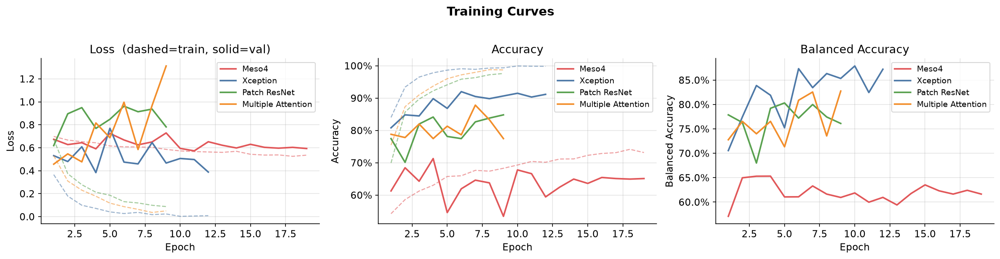
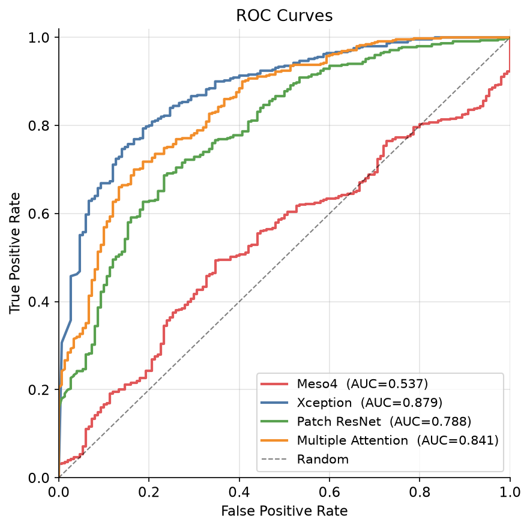
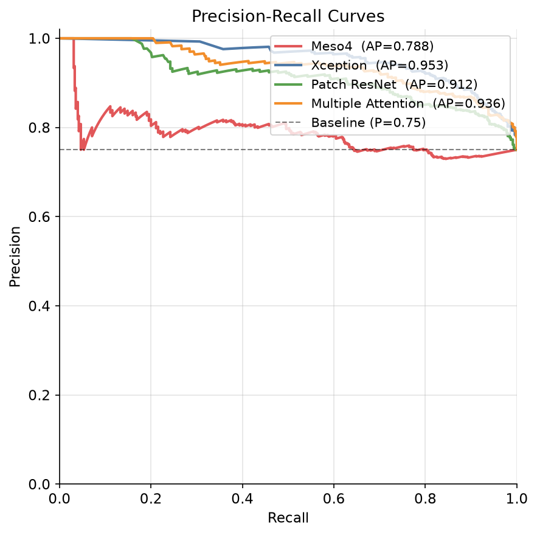
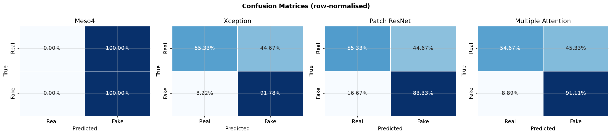
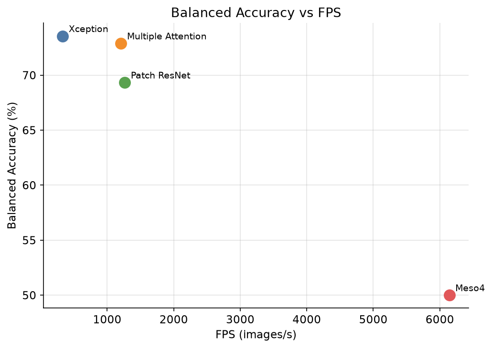
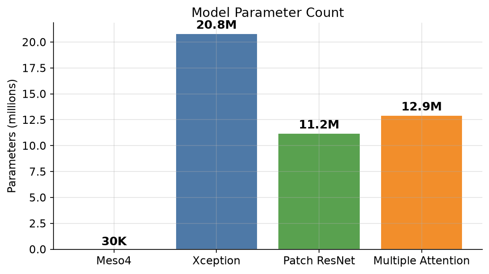

# Benchmarking Deepfake Detection Methods

<p align="center">


</p>

Implementation of the IEEE TDSC 2024 benchmark framework proposed in **"Towards Benchmarking and Evaluating Deepfake Detection"**.

## Overview

This repository benchmarks four representative deepfake detection architectures under a unified training and evaluation pipeline.

| Model | Detection Paradigm |
|:------|:-------------------|
| Meso4 | Lightweight CNN |
| Xception | Deep CNN |
| Patch ResNet | Patch-based CNN |
| Multiple Attention (M2TR-inspired) | Attention-based |

## Repository Structure

```text
.
├── Report
├── Original Paper
├── data/
│   ├── dataset.py
├── models/
│   ├── meso4.py
│   ├── xception.py
│   ├── patch_resnet.py
│   └── multiple_attention.py
├── train.py
├── benchmark.ipynb
├── test.py
├── weights/
├── results/
└── benchmark_output/
```

## Evaluation Metrics

- Accuracy
- Balanced Accuracy
- Precision / Recall / F1
- MCC
- ROC-AUC
- PR-AUC
- FLOPs
- Parameters
- FPS
- Latency

# Benchmark Results

## Detection Performance

| Model | Accuracy (%) | Balanced Acc. (%) | F1 (%) | ROC-AUC | PR-AUC | MCC |
|:------|-------------:|------------------:|--------:|--------:|-------:|----:|
| Meso4 | 75.00 | 50.00 | 85.71 | 0.5368 | 0.7881 | 0.0000 |
| Xception | **82.67** | **73.56** | **88.82** | **0.8791** | **0.9531** | **0.5100** |
| Patch ResNet | 76.33 | 69.33 | 84.08 | 0.7878 | 0.9119 | 0.3801 |
| Multiple Attention | 82.00 | 72.89 | 88.36 | 0.8411 | 0.9361 | 0.4925 |

## Computational Efficiency

| Model | Parameters (M) | GFLOPs | Model Size (MB) | FPS | Latency (ms/img) |
|:------|---------------:|-------:|----------------:|----:|-----------------:|
| Meso4 | 0.03 | 0.06 | 0.3 | **6551.6** | **0.15** |
| Xception | 20.81 | 5.98 | 238.6 | 336.2 | 2.97 |
| Patch ResNet | 11.18 | 2.38 | 128.0 | 1292.6 | 0.77 |
| Multiple Attention | 12.92 | 2.48 | 148.0 | 1240.4 | 0.81 |

## Benchmark Visualizations

### Training Curves



### ROC Curves



### Precision-Recall Curves



### Confusion Matrices



### Accuracy vs Speed



### Model Complexity



## Key Findings

- **Xception** achieved the best overall detection performance.
- **Multiple Attention** offered competitive performance with substantially lower computational cost than Xception.
- **Patch ResNet** provided a strong balance between efficiency and robustness.
- **Meso4** remained extremely fast and lightweight but showed limited discriminative performance.

## Reference

J. Deng et al., *Towards Benchmarking and Evaluating Deepfake Detection*, IEEE Transactions on Dependable and Secure Computing, 2024.

## Team

- Aditya Raj
- Amrit Dwivedi
- Keshav Agarwal
- Kushagra Chandra
- Mihir Tejaswi
